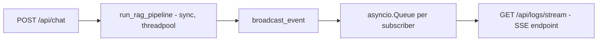

# Realtime Thinking Timeline di ConversationPage

## Analisis Masalah

### Arsitektur Backend (sudah benar ✅)
Backend sudah mengirimkan events secara realtime melalui **SSE (Server-Sent Events)**:



- `broadcast_event()` mengirim JSON ke semua subscriber queue (`_log_subscribers`)
- `StreamBroadcastHandler` juga membroadcast setiap log message
- `/api/logs/stream` adalah SSE endpoint yang mengalirkan events secara realtime
- `run_rag_pipeline()` adalah **synchronous function** yang berjalan di threadpool FastAPI — asyncio event loop tetap berjalan, sehingga SSE **dapat** dideliver secara realtime

### Arsitektur Frontend (masalah di sini ❌)

Ada **2 halaman** yang relevan:

| Halaman | Chat Request | SSE Stream | Thinking UI |
|---------|-------------|------------|-------------|
| [ChatPage.tsx](file:///c:/Users/NURDIN/Downloads/Nurdin/00_KULIAH/INFORMATIKA/SMT%209/SKRIPSI/Program/frontend/dir-rag-fe/src/pages/ChatPage.tsx) | `postChat()` (fetch POST) | ✅ `LogsStreamClient` connected on mount | ✅ `ThinkingTimeline` component |
| [ConversationPage.tsx](file:///c:/Users/NURDIN/Downloads/Nurdin/00_KULIAH/INFORMATIKA/SMT%209/SKRIPSI/Program/frontend/dir-rag-fe/src/pages/ConversationPage.tsx) | `postChat()` (fetch POST) | ❌ **Tidak ada** | ❌ Hanya spinner "Thinking..." |

### Root Cause

1. **`ConversationPage.tsx`** (halaman chat utama) **tidak** connect ke SSE stream sama sekali — log hanya muncul setelah `postChat()` selesai karena tidak pernah disubscribe ke `/logs/stream`
2. **`ChatPage.tsx`** sudah memiliki SSE stream, tetapi `ThinkingTimeline` ditampilkan di panel terpisah — bukan terintegrasi di dalam bubble chat seperti Gemini/GPT

> [!IMPORTANT]
> Perubahan utama hanya pada **frontend** — backend sudah bekerja dengan benar.

## Proposed Changes

### Komponen: Inline Thinking Bubble

#### [NEW] [InlineThinking.tsx](file:///c:/Users/NURDIN/Downloads/Nurdin/00_KULIAH/INFORMATIKA/SMT%209/SKRIPSI/Program/frontend/dir-rag-fe/src/components/InlineThinking.tsx)

Komponen baru yang menampilkan log events secara realtime **di dalam bubble chat** (seperti "thinking" di Gemini/GPT):
- Tampilkan sebagai collapsible section di atas bubble jawaban AI
- Setiap event muncul satu per satu dengan animasi fade-in
- Badge warna per stage (rq_rag, retrieval, reranker, dragin, generation, final_status)
- Auto-scroll ke event terbaru
- Collapse otomatis setelah jawaban final muncul
- Animasi loading dots saat masih memproses

Contoh visual:
```
┌─────────────────────────────────────────┐
│ 🔄 Thinking...                     ▼   │
│                                         │
│  [Refinement] Memulai Query Refinement  │
│  [Retrieval]  Retrieval refined_query   │
│  [Reranker]   Konteks dipangkas...      │
│  [DRAGIN]     Evaluasi DRAGIN           │
│  [Generasi]   Jawaban akhir (confident) │
│  ●●● (loading dots animation)           │
│                                         │
├─────────────────────────────────────────┤
│ Jawaban AI ditampilkan di sini setelah  │
│ pipeline selesai...                     │
└─────────────────────────────────────────┘
```

---

### Komponen: Custom Hook untuk SSE pada Chat

#### [NEW] [useThinkingStream.ts](file:///c:/Users/NURDIN/Downloads/Nurdin/00_KULIAH/INFORMATIKA/SMT%209/SKRIPSI/Program/frontend/dir-rag-fe/src/hooks/useThinkingStream.ts)

Custom hook yang mengelola koneksi SSE (`LogsStreamClient`) dan menyediakan state events:
- Connect ke SSE saat chat request dimulai
- Accumulate events ke dalam state
- Clear events saat user mengirim pesan baru
- Auto-disconnect saat `final_status` event diterima
- Return: `{ events, isThinking, startListening, reset }`

---

### Halaman: Integrasi ke ConversationPage

#### [MODIFY] [ConversationPage.tsx](file:///c:/Users/NURDIN/Downloads/Nurdin/00_KULIAH/INFORMATIKA/SMT%209/SKRIPSI/Program/frontend/dir-rag-fe/src/pages/ConversationPage.tsx)

Perubahan:
1. Import dan gunakan `useThinkingStream` hook
2. Saat `handleSubmit`:
   - Panggil `startListening()` **sebelum** `postChat()` — agar SSE sudah tersambung saat backend mulai emit events
   - Events akan streaming secara realtime ke `InlineThinking` component
3. Tampilkan `InlineThinking` component di dalam bubble chat saat `loading === true`
4. Setelah `postChat()` selesai, events berhenti dan collapsible ditutup

```diff
 {loading && (
     <div className="flex gap-4 w-full justify-start animate-in fade-in">
         <Avatar>...</Avatar>
-        <div className="...">
-            <Loader2 className="w-4 h-4 animate-spin" />
-            <span>Thinking...</span>
-        </div>
+        <InlineThinking events={thinkingEvents} isThinking={true} />
     </div>
 )}
```

## Verification Plan

### Manual Verification
1. Jalankan backend: `uvicorn app.main:app --reload` di folder `backend`
2. Jalankan frontend: `npm run dev` di folder `frontend/dir-rag-fe`
3. Buka **Conversation Page** di browser
4. Kirim pertanyaan ke chatbot
5. **Verifikasi bahwa:**
   - Saat pertanyaan dikirim, bubble "Thinking" muncul dengan events streaming secara realtime (satu per satu, bukan sekaligus)
   - Events memiliki badge warna sesuai stage (Refinement=biru, Retrieval=hijau, dll)
   - Loading dots animation muncul saat masih memproses
   - Setelah jawaban muncul, thinking section otomatis collapse
   - Jawaban AI muncul di bawah thinking section
6. **Verifikasi di ChatPage:**
   - Pastikan fitur yang sudah ada di `ChatPage.tsx` tetap berfungsi normal (tidak ada regresi)
